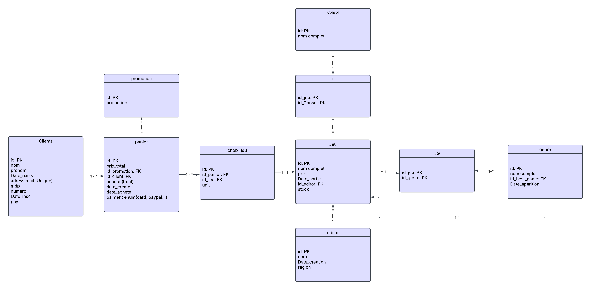
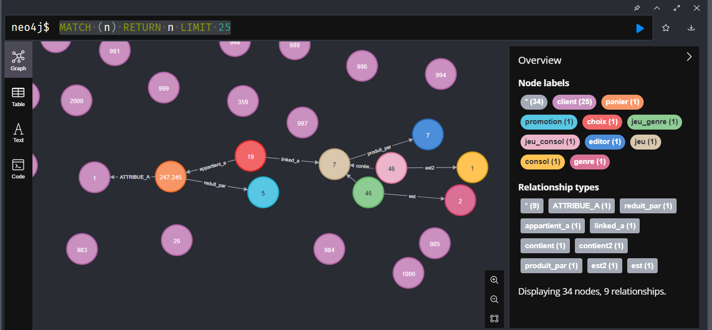

# Projet Base de Données Multisystèmes

Ce projet a pour but de modéliser, générer, manipuler et comparer une base de données multi-plateforme dans plusieurs SGBD (PostgreSQL, Oracle, Cassandra, Neo4j). Il se compose de 7 étapes principales décrites ci-dessous.

---

## 1. Conception de la base de données

L'objectif est de modéliser la structure relationnelle du projet en définissant les entités clés (Client, Jeu, Achat, Éditeur, Panier, Paiement, etc.), leurs relations, attributs, cardinalités et contraintes (clés primaires, étrangères, uniques, index).



---

## 2. Génération de données

Des scripts Python permettent de générer automatiquement les données :

- 1000 Clients avec leurs informations personnelles
- 100 Jeux avec leurs  date de sortie, le nombre en stock, l'editeur, liés à une ou plusieurs consoles et genres
- panier contenant la liste des achats, avec le prix total a payer
- Un historique d’achats réaliste, incluant plusieurs achats par client

Chaque script Python génère un fichier CSV distinct, placé dans le dossier `2_generation_des_donnes`. Les bibliothèques utilisées incluent Faker, pandas et csv.

---

## 3. Développement sur PostgreSQL

- Création du schéma SQL via un script DDL
- Insertion des données via `psql`
- Écriture de 20 scripts en PL/pgSQL correspondant à différents cas d’usage de SQL :
  - Fonctions stockées
  - Procédures
  - Curseurs
  - Gestion d’exceptions
  - Implémentation de triggers (ex. : mise à jour de stock après un achat)
  - Cas récursif
- L’ensemble des scripts est dans le dossier `3_pgsql` :
  - Fichier `.sql` pour la création des tables
  - Fichiers `.sql` séparés pour les 20 cas d’usage
  - Documentation des cas d’usage dans `scripts.pdf`

---

## 4. Portage Oracle

- Conversion du schéma PostgreSQL en schéma Oracle
- Réécriture des fonctions, triggers et scripts en PL/SQL
- Importation des données (simplifiée grâce à Oracle Database XE)
- Test des 20 cas d’usage dans l’environnement Oracle

Les scripts adaptés sont stockés dans le dossier `4_oracle`.

---

## 5. Déploiement Cassandra

Ce dossier (`5_cassandra/`) contient les fichiers nécessaires pour initialiser et tester une base de données Cassandra, dont `schema.cql`, `import_data.cql` et `requetes_test.cql`.

### Prérequis

- Ubuntu Server installé sur plusieurs machines virtuelles (au moins 3, idéalement jusqu’à 10 pour tester la réplication)
- Apache Cassandra installé sur chaque VM (version 4.x recommandée)

### Configuration réseau et cluster

1. Modifier le fichier `/etc/cassandra/cassandra.yaml` sur **chaque VM** :

   ```yaml
   # Nom du cluster
   cluster_name: 'JeuxCluster'  # Nom du cluster à définir

   # Seed nodes (nœuds de départ pour la découverte du cluster)
   seeds: "192.168.1.1"  # Remplacer par l'IP du nœud initial (VM1)

   # Adresse pour écouter les connexions internes entre nœuds
   listen_address: <IP_VM>   # Remplacer par l'IP de la VM actuelle

   # Adresse pour les connexions RPC (inter-nœuds)
   rpc_address: 0.0.0.0  # Écoute sur toutes les interfaces réseau

   # Adresse pour la diffusion de l'adresse aux autres nœuds
   broadcast_address: <IP_VM>  # Remplacer par l'IP de la VM actuelle

   # Adresse RPC pour la communication entre nœuds
   broadcast_rpc_address: <IP_VM>  # Remplacer par l'IP de la VM actuelle

   # Stratégie de gestion des nœuds dans le cluster
   endpoint_snitch: GossipingPropertyFileSnitch  # Méthode de découverte des nœuds
   ```


Redémarrer Cassandra :

```
sudo systemctl restart cassandra
```

Vérifier l'état du cluster avec :

```
nodetool status
```
Si tous les nœuds sont bien connectés, leur statut ("UN") apparaîtra dans la liste. Sinon, vérifiez la configuration réseau et les journaux système de Cassandra.

### Création du schéma & tests :

Depuis la machine initiale (seed), exécuter :

```
cqlsh
```

Puis lancer le fichier `schema.cql`, Importer les données (Assurez-vous que les fichiers `.csv` sont placés dans le dossier `bdd/` sur la VM initiale).

```
SOURCE 'schema.cql';
SOURCE 'import_data.cql';
```

Des requêtes d'exemple sont fournies dans le fichier `requetes_test.cql`. 

---

## 6. Benchmarking

- Sélection de 3 à 5 requêtes représentatives
- Utilisation d’un benchmark inspiré du TPC-C sur PostgreSQL et Oracle
- Mesure et comparaison des performances d’exécution des requêtes
- Résultats détaillés dans le fichier `6_Benchmark.pdf`

---

## 7. Conversion Neo4j

- Redéfinition du modèle relationnel en graphe
- Import des données via CSV et Cypher
- Création des relations : `(Client)-[ACHÈTE]->(Jeu)`
- Écriture de 10 scripts Cypher pour interroger la base

Les scripts sont disponibles dans le dossier `7_neo4j`.

Illustration des nœuds :


*Exemple de graphe généré avec Neo4j montrant les relations entre un client, son panier, le jeu acheté et l'éditeur.*

Client Stephen Smith a un panier de 247 euro reduit de 0.25%, pour acheter une copie de "Choose defense green several", jeu d'aventure edité par Austin-Johnson, ce client possède très probablement une Xbox One

---

## Technologies utilisées

- PostgreSQL, Oracle Database XE, Apache Cassandra, Neo4j Desktop
- Python 3, Faker, pandas
- Draw.io (diagramme UML)
- SQL Developer, psql, cqlsh, Cypher
- Oracle VM VirtualBox

---

## Structure des dossiers

1_diagram.png

2_generation_des_donnes/        # Scripts Python et CSV

3_pgsql/                        # SQL PostgreSQL (DDL + scripts)

4_oracle/                       # Scripts Oracle

5_cassandra/                    # Fichiers Cassandra (schema, import, requêtes)

6_Benchmark.pdf

7_neo4j/                        # Scripts Cypher

## Auteur

Yacine FEZOUI, yacine.fezoui2002@gmail.com
